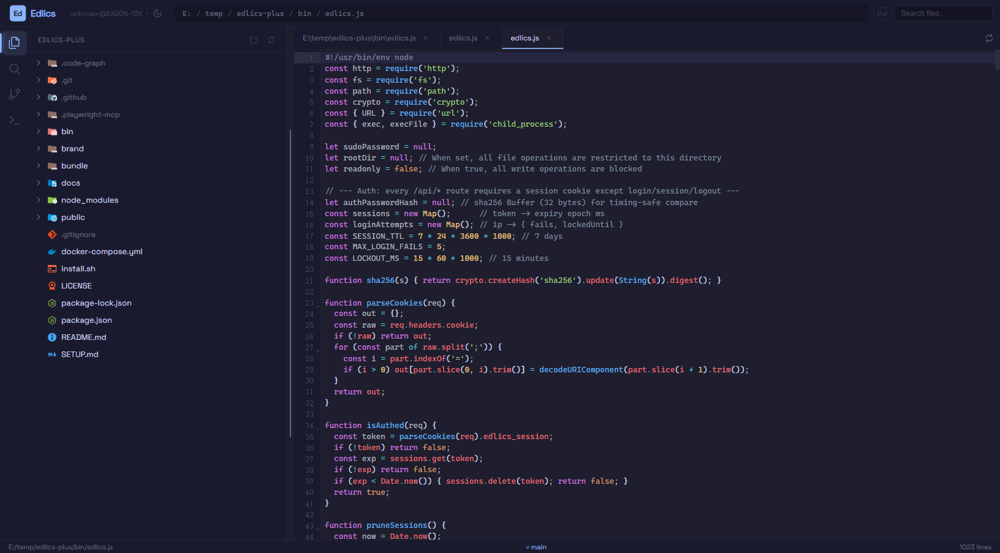
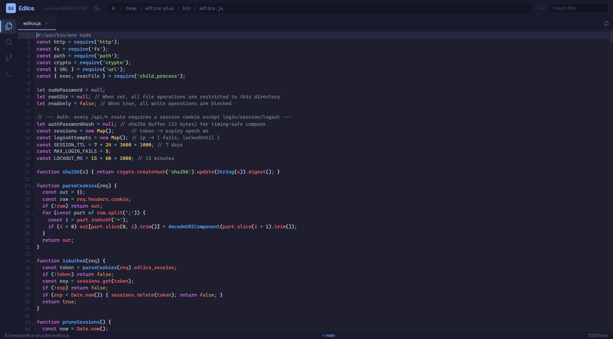
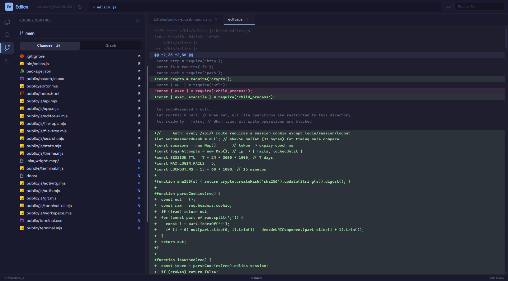
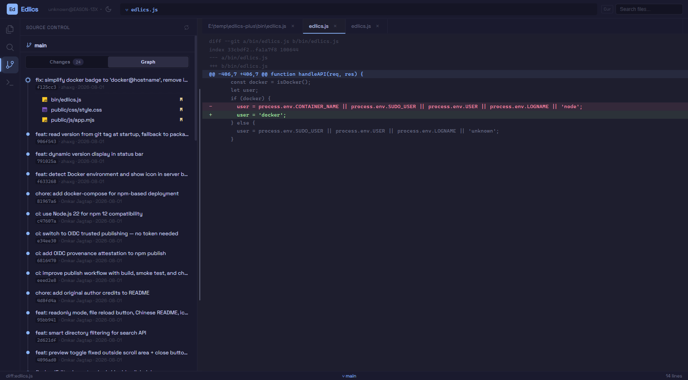
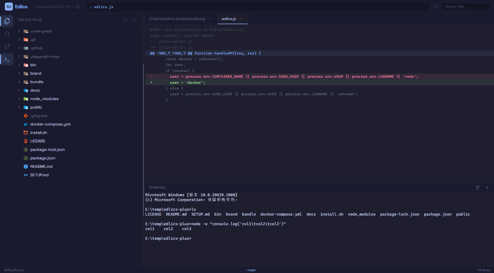
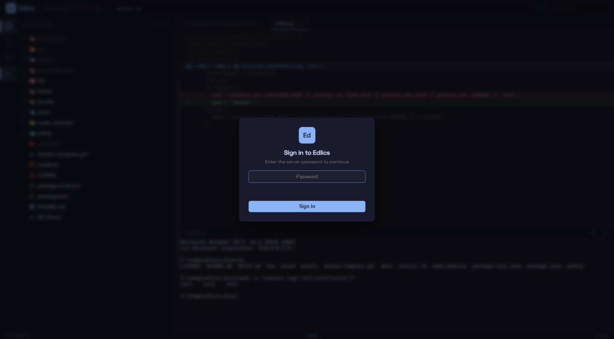

<p align="center">
  
</p>

<h1 align="center">Edlics-Plus</h1>

<p align="center">
  <strong>浏览器里的 VSCode 式 IDE —— 编辑器 · 文件树 · 搜索 · Git · 终端</strong>
  <br>
  一行命令把你的服务器变成网页 IDE，打开浏览器即可开发。
</p>

<p align="center">
  <a href="SETUP.md"></a>
  <a href="SETUP.md"></a>
  <a href="#快速开始"></a>
  <a href="#开发上手"></a>
  <a href="LICENSE"></a>
</p>

<br>



<br>

## 解决什么问题

你有一台 Linux 服务器（比如 AWS EC2），需要编辑配置文件、写代码或排查问题。通常你要 SSH 登录、在终端里用 `vim`、记快捷键、没法用鼠标、看不到目录结构——能用，但很麻烦。

**Edlics-Plus 把服务器变成一个网页版 VSCode**：运行一条命令，浏览器打开一个 URL，你就得到完整的文件树、语法高亮编辑器、全文搜索、Git 面板和**真实终端**。除了初始安装，不需要任何 SSH 技能。

<br>

## 快速开始

```bash
npx edlics-plus serve --hostname 0.0.0.0 --port 5000 --password '你的密码'
```

浏览器打开 `http://localhost:5000`（远程服务器则是 `http://服务器IP:5000`），**输入密码登录**后：

1. 点击左上角 **Open Folder**，在根目录范围内打开一个工程文件夹（记住在 localStorage，刷新不丢）
2. 左侧活动栏切换：**文件树 | 搜索 | Git | 终端**
3. 点文件编辑、`Ctrl+Shift+F` 全文搜索、Git 面板看变更和时间线、底部终端敲命令

限制文件操作范围 / 只读模式：

```bash
npx edlics-plus serve --hostname 0.0.0.0 --port 5000 --root /var/www --password '你的密码'
npx edlics-plus serve --hostname 0.0.0.0 --port 5000 --readonly
```

> 密码省略时会**自动生成并打印**在启动日志里；也可用环境变量 `EDLICS_PASSWORD`。
> 详见 [SETUP.md](SETUP.md)（所有安装方式、密码策略、故障排查）。

<br>

## 截图

| | |
|---|---|
| **全文搜索** | **Git 变更 + Diff** |
|  |  |
| **提交时间线 Graph** | **PTY 终端** |
|  |  |

| | |
|---|---|
| **登录保护** | **浅色 / 深色主题** |
|  | 点击工具栏月亮/太阳一键切换 |

<br>

## 功能特性

### 界面与工作区

| | |
|---|---|
| **密码登录** | 强制认证才能进入；sha256 恒时比较、5 次失败锁 15 分钟、HttpOnly 会话 7 天 |
| **活动栏（VSCode 式）** | 最左侧图标条切换 文件树 / 搜索 / Git / 终端，激活态高亮指示 |
| **工程文件夹（工作区）** | 在 `--root` 范围内打开一个项目目录，localStorage 记住，刷新自动恢复 |
| **可折叠文件树** | VSCode 式懒加载展开/收起，Material Design 图标（600+），隐藏文件淡化 |
| **标签页编辑器** | CodeMirror 6，14 种语言语法高亮，单击预览/双击固定，标签滚动与右键菜单 |
| **深色 / 浅色主题** | 一键切换，编辑器/终端/全部面板同步换肤，偏好本地保存 |
| **状态栏** | 用户@主机、当前分支、行号与修改状态、服务器 IP |

### 搜索

| | |
|---|---|
| **全文内容搜索** | `Ctrl+Shift+F`，整个工作区搜文本，结果按文件分组、命中高亮、Aa/.* 开关 |
| **点击跳转** | 点击任意命中行直接打开文件并定位到行列 |
| **文件名快搜** | `Ctrl+P` 顶栏按文件名过滤，自动排除 `node_modules`/`target` 等构建目录 |


### Git 面板

| | |
|---|---|
| **Changes 列表** | 分支名 + 变更文件（文件图标 + 右对齐 M/U/A/D 单字母状态，VSCode 风格），点击直接看 **diff** |
| **Graph 时间线** | 单线时间线展示提交历史（HEAD 空心大点、历史实心蓝点），点击提交展开改动文件，再点文件看该次提交的 **diff** |
| **只读安全** | 全部走 `execFile` 无 shell 注入，sha 白名单校验，workspace 必须位于 root 内 |


### 终端（真 PTY）

| | |
|---|---|
| **真实 TTY** | 基于 node-pty（与 [wede](https://github.com/vul-os/wede) 同架构思路）：shell 自己回显，光标跟手不跳动 |
| **完整终端语义** | Tab 制表符、`ls` 分栏输出、ANSI 颜色、方向键历史、Ctrl+C 中断、`cd` 原生持久 |
| **中文 / UTF-8** | ConPTY 原生支持，无需 chcp |
| **可拖拽高度** | 拖动面板顶边调节，双击复位，高度记忆在 localStorage |
| **快捷开关** | `Ctrl+\`` 或活动栏图标；垃圾桶按钮 = 重启 shell（无叠加残留） |


### 文件处理与安全

| | |
|---|---|
| **图片 / 二进制预览** | 点击图片直接预览；自动识别 30+ 种二进制格式（ELF、PE、ZIP、PDF、MP4…） |
| **Markdown / SVG 预览** | 实时渲染，编辑/预览一键切换 |
| **文件操作** | 右键新建、重命名、删除、上传、下载、复制路径 |
| **路径保护** | `--root` 限制所有操作在指定目录内（含符号链接逃逸防护、Windows 大小写/分隔符兼容） |
| **只读模式** | `--readonly` 禁止一切写操作，隐藏写菜单，适合公开演示 |
| **Sudo 支持** | 编辑受保护文件时按需提权，NOPASSWD 自动通过 |

<br>

## 快捷键

| 快捷键 | 功能 |
|--------|------|
| `Ctrl+S` | 保存文件 |
| `Ctrl+P` | 顶栏文件名快搜 |
| `Ctrl+W` | 关闭标签 |
| `F2` | 重命名文件 |
| `Ctrl+Shift+E` | 切到文件树 |
| `Ctrl+Shift+F` | 切到全文搜索 |
| `Ctrl+Shift+G` | 切到 Git 面板 |
| `Ctrl+\`` | 开关底部终端 |
| `Escape` | 关闭对话框 / 菜单 |

<br>

## 使用方法

```text
edlics serve [options]

Options:
  --hostname   绑定地址（默认: 127.0.0.1）
  --port       监听端口（默认: 3000）
  --root       限制文件操作的根目录（默认: 无限制）
  --password   登录密码（或环境变量 EDLICS_PASSWORD；省略则自动生成并打印）
  --readonly   只读模式 —— 禁止所有写操作
```

### 标签页行为

- **单击**文件 → 替换当前预览标签；**双击** → 固定/新开标签
- 标签过多时横向滚动（鼠标滚轮）
- 刷新按钮从磁盘重新加载内容

<br>

## 安全说明

- **必须密码登录**：所有 `/api/*` 未认证返回 401；sha256 + 恒时比较；同一 IP 连输 5 次错误锁定 15 分钟；HttpOnly + SameSite Cookie，7 天过期
- **`--root` 目录牢笼**：文件读写、搜索、Git、终端 cwd 全部校验路径 containment（含符号链接真实路径二次校验）
- **终端 = 完整 shell 权限**：登录用户通过终端可以执行该系统用户的任何命令——请像对待 SSH 私钥一样对待登录密码，不要泄露（与 [wede](https://github.com/vul-os/wede) 的威胁模型一致）
- **绑定地址**：默认只监听 `127.0.0.1`；对局域网开放请用 `--hostname 0.0.0.0` 并配合防火墙/强密码

<br>

## 智能搜索过滤

按特征文件自动识别项目类型，从文件名搜索中排除构建/缓存目录（每个子目录独立检测）：

| 特征文件 | 项目类型 | 排除目录 |
|---|---|---|
| `package.json` | Node.js | `node_modules`、`dist`、`.next`、`.nuxt`、`.cache`、`.turbo` |
| `go.mod` | Go | `vendor` |
| `pom.xml` / `build.gradle` | Java | `target`、`.gradle` |
| `.csproj` / `.sln` / `.slnx` | C# | `bin`、`obj`、`.vs`、`packages` |
| `requirements.txt` / `pyproject.toml` | Python | `__pycache__`、`.venv`、`venv`、`.mypy_cache`、`.tox` |
| `Cargo.toml` | Rust | `target` |
| `Gemfile` | Ruby | `vendor`、`.bundle` |

<br>

## 开发上手

### 环境准备

```bash
Node.js >= 18   # node --version
git --version
```

### 拉起项目

```bash
git clone https://github.com/zhaxg/edlics-plus.git
cd edlics-plus
npm install          # postinstall 会自动执行 npm run build（esbuild 打包编辑器 + 终端）
node bin/edlics.js serve --root . --password dev123
# 浏览器打开 http://localhost:3000 ，密码 dev123
```

> `--root .` 把文件操作限制在仓库目录内，本地开发更安全。

### 目录结构

```text
edlics-plus/
├── bin/
│   └── edlics.js              # 后端：http 服务 + 认证 + 文件 API + Git API + PTY 终端（单文件）
├── bundle/
│   ├── editor.mjs             # CodeMirror 6 打包入口 → public/editor.mjs
│   ├── terminal.mjs           # xterm.js 打包入口 → public/terminal.mjs + terminal.css
│   └── build-icons.mjs        # Material 图标 manifest 生成
├── public/                    # 前端静态资源（原样由服务器托管）
│   ├── index.html             # 页面骨架：活动栏 / 侧栏面板 / 编辑区 / 终端 / 登录遮罩
│   ├── css/style.css          # 全部样式（CSS 变量实现明暗主题）
│   ├── js/
│   │   ├── app.mjs            # 主入口：快捷键、初始化、登录后 boot
│   │   ├── auth.mjs           # 登录遮罩与会话
│   │   ├── activity.mjs       # 活动栏视图切换 / 终端开关
│   │   ├── workspace.mjs      # 打开文件夹对话框 + localStorage 记忆
│   │   ├── file-tree.mjs      # 可折叠文件树（懒加载）
│   │   ├── search.mjs         # 文件名快搜 + 全文搜索面板
│   │   ├── git.mjs            # Git 面板（Changes / Graph 时间线 / diff）
│   │   ├── terminal-ui.mjs    # xterm + PTY 流式输入输出
│   │   ├── editor-ui.mjs      # CodeMirror 标签页、路径栏、diff 视图
│   │   ├── file-ops.mjs       # 打开/保存/重命名/删除（支持跳转行列）
│   │   ├── state.mjs api.mjs theme.mjs …
│   ├── icons/                 # Material Design 图标（600+ SVG）
│   ├── editor.mjs             # esbuild 产物（勿手改）
│   └── terminal.mjs/.css      # esbuild 产物（勿手改）
├── docs/screenshots/          # README 截图
├── .github/workflows/         # publish.yml：tag 触发发 npm（OIDC）
├── install.sh                 # 依赖安装 + symlink 安装
└── package.json
```

### 前端调试须知

- **业务代码无构建**：`public/js/*.mjs` 是原生 ES Module，服务器不缓存，改完**刷新浏览器即生效**
- **需要打包的只有两个 bundle**（改到才需要重新 `npm run build`）：
  - `bundle/editor.mjs` → CodeMirror 相关
  - `bundle/terminal.mjs` → xterm 相关
- 主题：`theme.mjs` 里 `THEME_LIGHT` 定义 CSS 变量组；xterm 调色板在 `terminal-ui.mjs` 的 `XTERM_DARK/XTERM_LIGHT`

### 后端调试须知

- `bin/edlics.js` 单文件：路由是 `/api/*` 的 if-链，新端点按同样模式追加
- **认证中间件**：`login` / `session` / `logout` 之外的所有 `/api/*` 都要求会话 Cookie（在 `handleAPI` 顶部统一拦截）
- **路径安全**：任何接收路径的端点必须先过 `isPathSafe()`（root containment + 符号链接真实路径）
- **Git 端点**：一律 `execFile('git', [...])`（无 shell），sha 用 `/^[0-9a-f]{4,40}$/i` 白名单，pathspec 放在 `--` 之后
- **终端**：`node-pty` 懒加载（`getPty()`），一个登录会话一个 PTY；`open/stream/input/resize/close` 五个端点；重启 shell 用 trash 按钮

### node-pty（原生模块）

终端依赖 [node-pty](https://github.com/nicktomkin/node-pty)。主流平台安装时走预编译二进制；若编译失败：

```bash
# Debian/Ubuntu
sudo apt install -y build-essential python3
npm install
```

详见 [SETUP.md](SETUP.md#终端功能说明node-pty)。

### 质量检查（提交前）

```bash
node --check bin/edlics.js        # 后端语法
node --check public/js/*.mjs      # 前端语法
npm run build                     # bundle 可构建
timeout 3 node bin/edlics.js serve --port 19999 || true   # 冒烟：能启动
```

### 发布流程

```bash
npm version patch    # 或 minor / major
git push --tags      # 推 tag → GitHub Actions 自动发 npm
```

`.github/workflows/publish.yml`（仅 `v*` tag 触发）：设版本 → `npm install` → `npm run build` → 冒烟测试 → 生成 CHANGELOG → OIDC Trusted Publishing 发布。**直接 push main 不会触发发布**。

<br>

## 工作原理

1. `edlics serve` 在本机启动一个 Node.js Web 服务器（无数据库、无框架）
2. 浏览器访问后先经过**密码登录**，拿到 HttpOnly 会话
3. Open Folder 在 root 范围内选定工作区，文件树/搜索/Git/终端全部以它为根
4. 文件读写直接操作磁盘；搜索走 Node 目录遍历；Git 走 `execFile` 调用本机 git
5. 终端为每个会话 spawn 一个**真实 PTY shell**，字节流原样往返
6. `--root` 时服务器不碰目录外任何文件；`--readonly` 时拒绝一切写操作

<br>

## 技术栈

- **前端**：原生 JavaScript ES Modules（业务零构建）、CodeMirror 6、xterm.js、CSS 自定义属性主题
- **后端**：Node.js 原生 `http`，无框架无数据库
- **终端**：node-pty（ConPTY / POSIX PTY）
- **构建**：esbuild（仅两个 bundle）
- **CI/CD**：GitHub Actions → npm OIDC Trusted Publishing
- **图标**：Material Design 文件树图标（600+ SVG）

<br>

## 许可证

MIT —— 自由使用、分享、二次开发。

<br>

## 致谢

本项目基于 [opermancode/edlics](https://github.com/opermancode/edlics) 二次开发，感谢原作者 **opermancode** 的开源贡献。

Edlics-Plus 在原版基础上进行了大规模扩展与重构：密码认证、VSCode 式活动栏与可折叠文件树、工程工作区、全文搜索、Git 面板（变更/时间线/diff）、node-pty 真实终端、明暗双主题、模块化前端架构等。终端架构参考了 [wede](https://github.com/vul-os/wede) 等 web IDE 的 PTY 方案。
